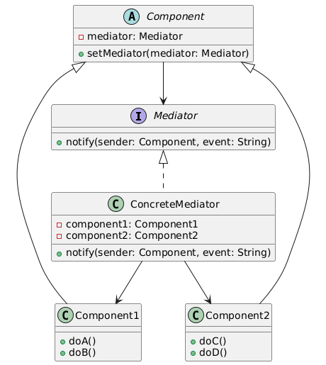
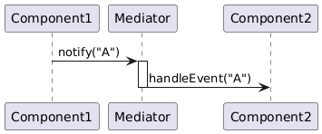

# The Mediator Design Pattern
### Simplifying Communication Between Objects  
**Presented by:** Jwan  
**Date:** [Your Presentation Date]

---

## Introduction
**Definition (GoF):**
> "The Mediator pattern defines an object that encapsulates how a set of objects interact..."

- **Pattern Category:** Behavioral
- **Goal:** Centralize complex communications and control logic

---

## Problem It Solves
- Many-to-many interactions = tight coupling
- Example: UI components talking directly
- **Problem:** Fragile, tangled code
- **Solution:** Use a Mediator to manage communication

---

## Class Diagram

---

## Sequence Diagram

---

## Real-World Examples
- **UI Dialog Box** – buttons, fields interact via Mediator
- **Chatroom App** – users communicate through central server
- **Game Engine** – Mediator coordinates entities and UI

---

## Advantages & Disadvantages
**Advantages:**
- Reduces direct dependencies
- Centralizes logic
- Easier maintenance

**Disadvantages:**
- Can become a God Object
- Adds indirection

---

## Personal Commentary
> "Like an air traffic controller – it ensures safe, centralized coordination."

- Great for UI and IoT coordination
- Makes systems more robust and flexible

---

## Scientific Reference
**Title:** _Design Patterns: Elements of Reusable Object-Oriented Software_  
**Authors:** Gamma, Helm, Johnson, Vlissides  
**Publisher:** Addison-Wesley, 1994  

Also consulted modern IEEE articles on pattern usage

---

## Wrap-Up & Q/A
### Recap:
- Solves complex communication
- Mediator = centralized logic
- Common in UI and system coordination

**Any Questions?**

